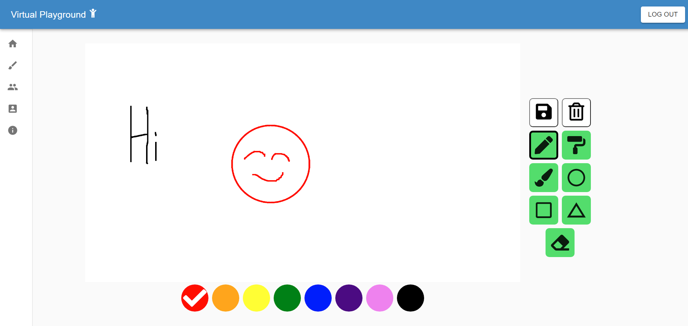

# SE750/CS732 Group-19-Orange-Ox

<br/><br/>


## Getting Started

These instructions will get you a copy of the project up and running on your local machine for development and testing purposes.

### Prerequisites

* [MERN Stack](https://www.mongodb.com/mern-stack)
* [Material UI](https://material-ui.com/)
* [react-p5](https://www.npmjs.com/package/react-p5)
* [auth0](https://auth0.com/)
* [socket.io](https://socket.io/)

### Installing

* Go to the frontend directory, and then
```
npm install
```
* Likewise, go to the backend directory, and then
```
npm install
```
* create a ```.env ``` file in the frontend directory.
use the [.env.example](./frontend/.env.example) file as an example.


### Running

* Go to the frontend directory, and then
```
npm run start
```
to run the frontend React App on port 3000.

* Likewise, go to the backend directory, and then
```
npm run start
```
to run the backend Express HTTP server on port 3001.
* and the Express Websocket server on port 4001.

## Running the tests

### Running the shallow tests on the frontend
Go to the frontend directory, and then
```
npm run test
```

## Notes for Warnings and Errors
```
Warning: findDOMNode is deprecated in StrictMode. findDOMNode was passed an instance of Transition which is inside StrictMode. Instead, add a ref directly to the element you want to reference.
```
This issue is related to the Material UI Tooltips. The tooltips wrap around the components and are assigned keys and id's. However, this warning is triggered.

## Authors

* Mike Lee
* Jusin Kim
* Callum Bradding

## License

[__GNU General Public License__](LICENSE)
