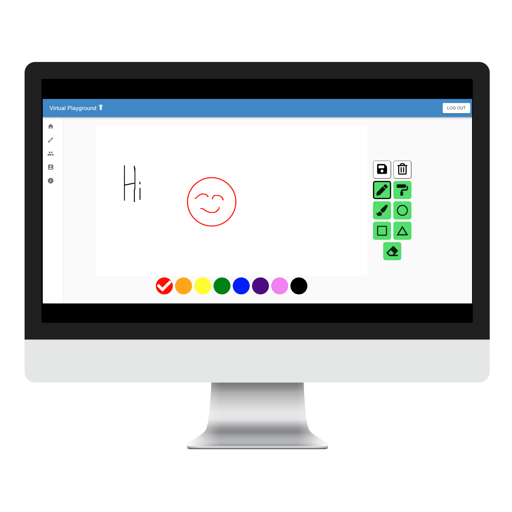

# SE750/CS732 Group-19-Orange-Ox


# Kids' Virtual Playground Project


This is a virtual drawing canvas Web App for kids aged 5 to 10 years old, especially designed for COVID-19 lockdowns.

This is designed for virtual play dates to encourage social as well as cognitive growth in children.

## Getting Started

These instructions will get you a copy of the project up and running on your local machine for development and testing purposes.

### Prerequisites

* [MERN Stack](https://www.mongodb.com/mern-stack)
* [Material UI](https://material-ui.com/)
* [react-p5](https://www.npmjs.com/package/react-p5)
* [socket.io](https://socket.io/)

### Installing

* Go to the *frontend* directory, and then
```
npm install
```
* Likewise, go to the *backend* directory, and then
```
npm install
```
* Create a `.env` file in the *frontend* directory.
Use the [frontend/.env.example](./frontend/.env.example) file as an example.

* Create a `.env` file in the *backend* directory.
Use the [backend/.env.example](./backend/.env.example) file as an example.

### Running

* Go to the *frontend* directory, and then
```
npm run start
```
to run the frontend React App on port 3000.

* Likewise, go to the *backend* directory, and then
```
npm run start
```
to run the backend Express HTTP server on port 3001.
* and the Express Websocket server on port 4001.

## Running the tests

### Backend Testing
In the *backend* directory, run command:
```
npm test
```
this will run the tests for MongoDB and Express.

### Frontend (Shallow) Testing
In the *frontend* directory, run command:
```
npm run test
```

## Wiki and Notes
[GitHub Wiki](https://github.com/st970703/Group-19-Orange-Ox/wiki)

## Authors
* Mike Lee (st970703)
* Jusin Kim (naznsan)
* Callum Bradding (calcalbrad)

## License

[__GNU General Public License__](LICENSE)
